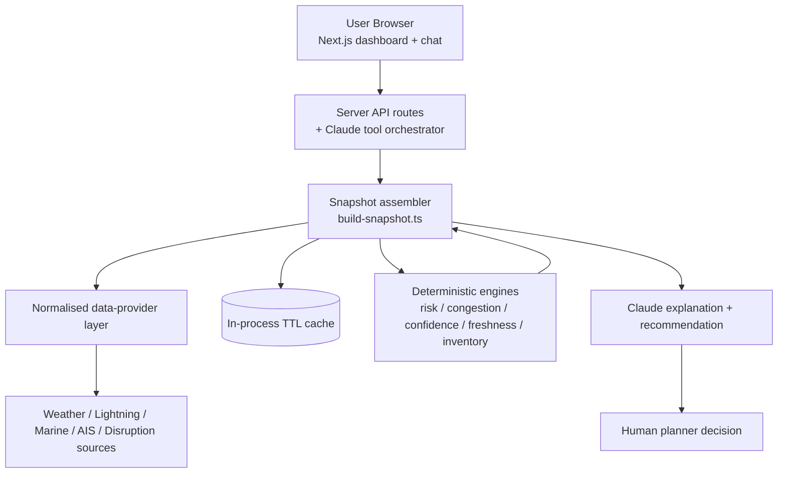

# Architecture

This document is detailed enough to write an architecture reflection slide
directly from it.

## 1. High-level flow

The critical property: **the deterministic engines compute every number, and the
snapshot is assembled, before Claude is ever called.** Claude receives the
finished snapshot as context and can only read further figures through tools that
return the same engine outputs. It cannot compute or overwrite a number.

## 2. Layers and their responsibilities

| Layer | Location | Responsibility |
| --- | --- | --- |
| Types | `src/types` | `DataStatus`, `DataEnvelope<T>`, domain + snapshot types. |
| Schemas | `src/lib/schemas` | Zod validation for every external response and every tool input. |
| Engines | `src/lib/risk`, `src/lib/simulator` | Pure deterministic math; single config file. |
| Fixtures | `src/fixtures` | Four seeded demo scenarios. |
| Providers | `src/lib/data-providers` | Live fetch + demo fallback per source. |
| Snapshot | `src/lib/snapshot` | Assembles the one shared dataset. |
| AI | `src/lib/ai` | System prompt, tool defs, tool runner, client, offline summary. |
| API routes | `src/app/api/*` | Thin HTTP wrappers over the snapshot / engines / assistant. |
| UI | `src/components`, `src/app/*` | Dashboard, map, charts, chat, simulator, diagnostics, methodology, settings. |

## 3. The shared snapshot (why one dataset)

`build-snapshot.ts` produces a single `DashboardSnapshot` for a given
(`mode`, `scenario`). The dashboard cards, map, charts, disruption panel,
simulator summary **and** the chatbot context are all derived from it. This is a
deliberate design choice from the spec: it makes it impossible for the chatbot to
disagree with the dashboard, because they read the identical numbers.

Data flow inside the assembler:

1. Resolve five feeds → each returns a classified `DataEnvelope<T>`
   (demo → SIMULATED; live → LIVE, or CACHED on failure with a cache hit, or
   UNAVAILABLE).
2. Derive **Estimated Congestion** from the vessel snapshot (classified
   ESTIMATED).
3. Compute **confidence** from all five feeds (reliability, freshness, geographic
   relevance, availability, agreement, status) — never `100 − risk`.
4. Compute the **simulator** option comparison from the scenario defaults.
5. Compute **overall risk** from weather + congestion + disruptions + cargo
   exposure + data-quality penalty.
6. Generate deterministic **history** for the charts.
7. Derive **connectivity** (operational / degraded / demo / critical).

## 4. Request/runtime notes

- Every API route sets `runtime = "nodejs"` (the SDK and AIS provider need Node).
- Snapshot routes are `force-dynamic` (no caching of live data).
- Leaflet is loaded via `dynamic(() => import(...), { ssr: false })` because it
  touches `window` at import time.
- Timestamps render client-side after mount to avoid hydration mismatch.
- Demo data is produced by a seeded PRNG (`mulberry32`) driven by `DEMO_SEED`;
  `Math.random()` is never used in fixture/demo code.

## 5. Security posture

All authenticated calls are server-side; keys are read only in
`src/lib/config/env.ts` (guarded by `server-only`). The hardened `safeFetchJson`
enforces timeouts, limited retries with exponential backoff, rate-limit handling
and an http/https allow-list, and it never surfaces raw provider errors. See
[security-and-hallucination-risks.md](security-and-hallucination-risks.md).
